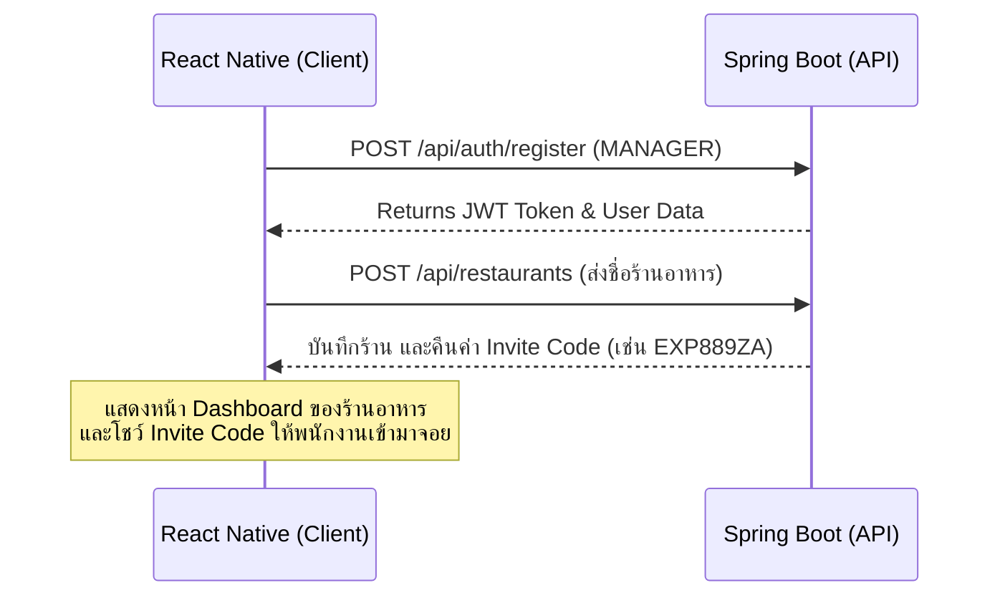
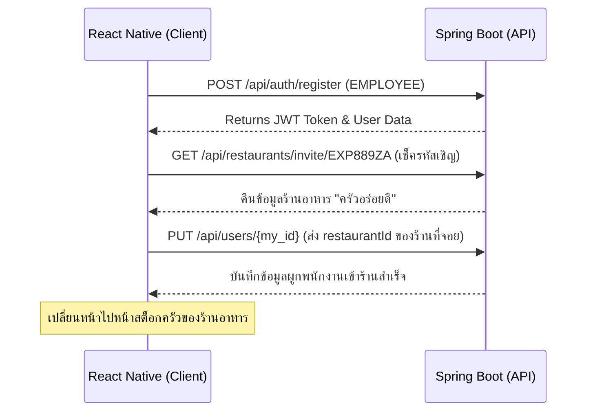
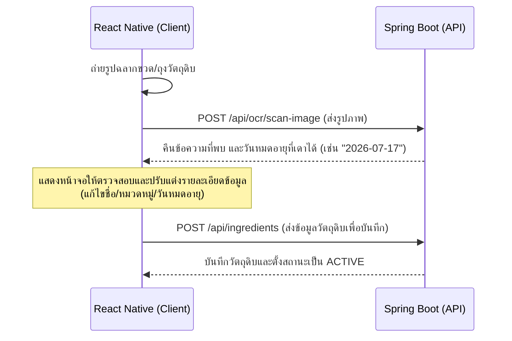

# API Specification: Smart Expiry Date Notification System (Backend)

เอกสารฉบับนี้สรุปรายละเอียด API Endpoints ทั้งหมดของระบบหลังบ้าน (Java Spring Boot) สำหรับให้นักพัฒนาหรือ Agent ฝั่ง Frontend นำไปใช้อ้างอิงในการเชื่อมต่อระบบจริง ทั้งโครงสร้างข้อมูล (JSON Payloads) สถานะ HTTP Status Codes และการจัดการความปลอดภัย (Authentication/Authorization)

---

## 1. ข้อมูลพื้นฐานและการรักษาความปลอดภัย (Base Settings & Security)

* **Base URL:** `http://localhost:8080/api` หรือผ่านค่า Environment Variable `API_URL`
* **Authentication:** ใช้ **JSON Web Token (JWT)**
  * หลังจาก Login/Register สำเร็จ จะได้รับ JWT Token กลับไปในฟิลด์ `token`
  * ทุก Request ที่ต้องผ่านการตรวจสอบสิทธิ์ (Authenticated Endpoints) จะต้องแนบ Header ดังนี้:
    ```http
    Authorization: Bearer <your_jwt_token>
    Content-Type: application/json
    ```

### รูปแบบ Error Response มาตรฐาน
หากเกิดข้อผิดพลาดในการดึงข้อมูลหรือกรอกข้อมูลผิดพลาด ระบบจะตอบกลับด้วยรูปแบบ JSON มาตรฐานนี้:
```json
{
  "timestamp": "2026-07-10T11:25:00Z",
  "status": 400,
  "error": "Bad Request",
  "message": "รหัสคำเชิญ (Invite Code) ไม่ถูกต้อง",
  "path": "/api/restaurants/invite/INVALID123"
}
```

---

## 2. API Endpoints แยกตามโมดูล (Modules API Reference)

### 2.1 Authentication & Profile
โมดูลสำหรับจัดการบัญชีผู้ใช้ ล็อกอิน สมัครสมาชิก และดึงข้อมูลตนเอง

#### 1. สมัครสมาชิกใหม่ (Register)
* **Endpoint:** `POST /api/auth/register`
* **Authentication Required:** No
* **Request Body:**
  ```json
  {
    "email": "user@example.com",
    "password": "Password123!",
    "displayName": "สมชาย ใจดี",
    "role": "MANAGER",
    "restaurantId": null
  }
  ```
  *(หมายเหตุ: `role` สามารถส่งเป็น `"MANAGER"` หรือ `"EMPLOYEE"` ได้, `restaurantId` ส่งเป็น `null` ได้หากพนักงานลงทะเบียนก่อนเข้าทำงาน หรือส่ง ID ของร้านอาหารหากทราบ)*
* **Response (201 Created):**
  ```json
  {
    "token": "eyJhbGciOiJIUzI1NiJ9.eyJzdWIiOiJ1c2VyQGV4YW1wbGUuY29tIiwiaWQiOiIzY...",
    "user": {
      "id": "a90f12c8-8dfa-4fb4-9c98-84222384a6db",
      "email": "user@example.com",
      "displayName": "สมชาย ใจดี",
      "role": "MANAGER",
      "restaurantId": null
    }
  }
  ```

#### 2. เข้าสู่ระบบ (Login)
* **Endpoint:** `POST /api/auth/login`
* **Authentication Required:** No
* **Request Body:**
  ```json
  {
    "email": "user@example.com",
    "password": "Password123!"
  }
  ```
* **Response (200 OK):**
  ```json
  {
    "token": "eyJhbGciOiJIUzI1NiJ9.eyJzdWIiOiJ1c2VyQGV4YW1wbGUuY29tIiwiaWQiOiIzY...",
    "user": {
      "id": "a90f12c8-8dfa-4fb4-9c98-84222384a6db",
      "email": "user@example.com",
      "displayName": "สมชาย ใจดี",
      "role": "MANAGER",
      "restaurantId": "5fa23d91-45a8-4bb4-ad74-32bdf01a2d56"
    }
  }
  ```

#### 3. ออกจากระบบ (Logout)
* **Endpoint:** `POST /api/auth/logout`
* **Authentication Required:** No (เคลียร์ฝั่ง Client-side storage)
* **Response (204 No Content):** (ไม่มีเนื้อหาตอบกลับ)

#### 4. ดึงข้อมูลโปรไฟล์ผู้ใช้ปัจจุบัน (Get Current User Profile)
* **Endpoint:** `GET /api/auth/me` หรือ `GET /api/users/me`
* **Authentication Required:** Yes
* **Response (200 OK):**
  ```json
  {
    "id": "a90f12c8-8dfa-4fb4-9c98-84222384a6db",
    "email": "user@example.com",
    "displayName": "สมชาย ใจดี",
    "role": "MANAGER",
    "restaurantId": "5fa23d91-45a8-4bb4-ad74-32bdf01a2d56"
  }
  ```

---

## 2.2 Users Management
โมดูลดึงรายละเอียดสมาชิกและอัปเดตบทบาทหรือความผูกพันของร้านอาหาร

#### 1. ดึงข้อมูลสมาชิกรายบุคคล (Get User by ID)
* **Endpoint:** `GET /api/users/{id}`
* **Authentication Required:** Yes
* **Response (200 OK):**
  ```json
  {
    "id": "a90f12c8-8dfa-4fb4-9c98-84222384a6db",
    "email": "user@example.com",
    "displayName": "สมชาย ใจดี",
    "role": "MANAGER",
    "restaurantId": "5fa23d91-45a8-4bb4-ad74-32bdf01a2d56"
  }
  ```

#### 2. อัปเดตข้อมูลผู้ใช้งาน (Update User Profile / Affiliation)
ใช้สำหรับเปลี่ยนชื่อเล่น บทบาท หรือระบุว่าพนักงานคนนี้ทำงานร้านอาหารใดเมื่อกรอกรหัสเชิญชวน (Invite Code)
* **Endpoint:** `PUT /api/users/{id}`
* **Authentication Required:** Yes
* **Request Body:**
  ```json
  {
    "displayName": "สมชาย แสนดี",
    "role": "EMPLOYEE",
    "restaurantId": "5fa23d91-45a8-4bb4-ad74-32bdf01a2d56"
  }
  ```
* **Response (200 OK):**
  ```json
  {
    "id": "a90f12c8-8dfa-4fb4-9c98-84222384a6db",
    "email": "user@example.com",
    "displayName": "สมชาย แสนดี",
    "role": "EMPLOYEE",
    "restaurantId": "5fa23d91-45a8-4bb4-ad74-32bdf01a2d56"
  }
  ```

#### 3. ดึงสมาชิกทั้งหมดในร้านอาหาร (Get Users by Restaurant)
* **Endpoint:** `GET /api/users?restaurantId=5fa23d91-45a8-4bb4-ad74-32bdf01a2d56`
* **Authentication Required:** Yes
* **Response (200 OK):**
  ```json
  [
    {
      "id": "a90f12c8-8dfa-4fb4-9c98-84222384a6db",
      "email": "manager@restaurant.com",
      "displayName": "Manager Somchai",
      "role": "MANAGER",
      "restaurantId": "5fa23d91-45a8-4bb4-ad74-32bdf01a2d56"
    },
    {
      "id": "df68903c-e7e2-4ea5-8ea5-00c7e26bf692",
      "email": "employee1@restaurant.com",
      "displayName": "Staff Dang",
      "role": "EMPLOYEE",
      "restaurantId": "5fa23d91-45a8-4bb4-ad74-32bdf01a2d56"
    }
  ]
  ```

---

## 2.3 Restaurant Management
โมดูลสำหรับผู้ดูแลร้าน (Manager) ในการสร้างร้านอาหาร รับโค้ด และสิทธิ์เชิญชวนพนักงาน

#### 1. สร้างร้านอาหารใหม่ (Create Restaurant)
* **Endpoint:** `POST /api/restaurants`
* **Authentication Required:** Yes (MANAGER only)
* **Request Body:**
  ```json
  {
    "name": "ครัวอร่อยดี สาขาลาดพร้าว"
  }
  ```
* **Response (201 Created):**
  ```json
  {
    "id": "5fa23d91-45a8-4bb4-ad74-32bdf01a2d56",
    "name": "ครัวอร่อยดี สาขาลาดพร้าว",
    "managerId": "a90f12c8-8dfa-4fb4-9c98-84222384a6db",
    "inviteCode": "EXP889ZA",
    "createdAt": "2026-07-10T11:30:00Z",
    "updatedAt": "2026-07-10T11:30:00Z"
  }
  ```

#### 2. ดึงรายละเอียดร้านอาหาร (Get Restaurant Details)
* **Endpoint:** `GET /api/restaurants/{id}`
* **Authentication Required:** Yes
* **Response (200 OK):**
  ```json
  {
    "id": "5fa23d91-45a8-4bb4-ad74-32bdf01a2d56",
    "name": "ครัวอร่อยดี สาขาลาดพร้าว",
    "managerId": "a90f12c8-8dfa-4fb4-9c98-84222384a6db",
    "inviteCode": "EXP889ZA",
    "createdAt": "2026-07-10T11:30:00Z",
    "updatedAt": "2026-07-10T11:30:00Z"
  }
  ```

#### 3. ค้นหาร้านอาหารด้วยโค้ดเชิญชวน (Get Restaurant by Invite Code)
ใช้เพื่อแสดงชื่อร้านให้พนักงานยืนยันก่อนกดตกลงเข้าร่วมร้านอาหาร
* **Endpoint:** `GET /api/restaurants/invite/{inviteCode}`
* **Authentication Required:** Yes
* **Response (200 OK):**
  ```json
  {
    "id": "5fa23d91-45a8-4bb4-ad74-32bdf01a2d56",
    "name": "ครัวอร่อยดี สาขาลาดพร้าว",
    "managerId": "a90f12c8-8dfa-4fb4-9c98-84222384a6db",
    "inviteCode": "EXP889ZA",
    "createdAt": "2026-07-10T11:30:00Z",
    "updatedAt": "2026-07-10T11:30:00Z"
  }
  ```

#### 4. รีเซ็ต/สร้างรหัสเชิญชวนใหม่ (Regenerate Invite Code)
* **Endpoint:** `POST /api/restaurants/{id}/invite-code`
* **Authentication Required:** Yes (MANAGER only)
* **Response (200 OK):**
  ```json
  {
    "id": "5fa23d91-45a8-4bb4-ad74-32bdf01a2d56",
    "name": "ครัวอร่อยดี สาขาลาดพร้าว",
    "managerId": "a90f12c8-8dfa-4fb4-9c98-84222384a6db",
    "inviteCode": "NEW991TR",
    "createdAt": "2026-07-10T11:30:00Z",
    "updatedAt": "2026-07-10T11:32:00Z"
  }
  ```

---

## 2.4 Ingredients Management (Core Features)
ระบบสำหรับจัดการวัตถุดิบและสต็อกสินค้าในครัว ซึ่งเป็นหัวใจสำคัญของแอปพลิเคชัน

#### 1. เพิ่มวัตถุดิบชิ้นใหม่ (Create Ingredient)
* **Endpoint:** `POST /api/ingredients`
* **Authentication Required:** Yes
* **Request Body:**
  ```json
  {
    "restaurantId": "5fa23d91-45a8-4bb4-ad74-32bdf01a2d56",
    "name": "นมสดพาสเจอร์ไรส์ 1L",
    "category": "นมและผลิตภัณฑ์จากนม",
    "expiryDate": "2026-07-17",
    "notifyDaysBefore": 3,
    "scannedBy": "df68903c-e7e2-4ea5-8ea5-00c7e26bf692"
  }
  ```
  *(รูปแบบวันที่ส่งเป็น `yyyy-MM-dd`)*
* **Response (201 Created):**
  ```json
  {
    "id": "8b51a021-39fe-443b-9a4f-56bb42cfaee4",
    "restaurantId": "5fa23d91-45a8-4bb4-ad74-32bdf01a2d56",
    "name": "นมสดพาสเจอร์ไรส์ 1L",
    "category": "นมและผลิตภัณฑ์จากนม",
    "expiryDate": "2026-07-17",
    "notifyDaysBefore": 3,
    "status": "ACTIVE",
    "scannedBy": "df68903c-e7e2-4ea5-8ea5-00c7e26bf692",
    "scannedAt": "2026-07-10T11:35:00Z",
    "updatedBy": "df68903c-e7e2-4ea5-8ea5-00c7e26bf692",
    "createdAt": "2026-07-10T11:35:00Z",
    "updatedAt": "2026-07-10T11:35:00Z"
  }
  ```

#### 2. ดึงรายการวัตถุดิบทั้งหมด (Get Ingredients List)
* **Endpoint:** `GET /api/ingredients?restaurantId=5fa23d91-45a8-4bb4-ad74-32bdf01a2d56&status=ACTIVE`
* **Authentication Required:** Yes
* **Response (200 OK):**
  ```json
  [
    {
      "id": "8b51a021-39fe-443b-9a4f-56bb42cfaee4",
      "restaurantId": "5fa23d91-45a8-4bb4-ad74-32bdf01a2d56",
      "name": "นมสดพาสเจอร์ไรส์ 1L",
      "category": "นมและผลิตภัณฑ์จากนม",
      "expiryDate": "2026-07-17",
      "notifyDaysBefore": 3,
      "status": "ACTIVE",
      "scannedBy": "df68903c-e7e2-4ea5-8ea5-00c7e26bf692",
      "scannedAt": "2026-07-10T11:35:00Z",
      "updatedBy": "df68903c-e7e2-4ea5-8ea5-00c7e26bf692",
      "createdAt": "2026-07-10T11:35:00Z",
      "updatedAt": "2026-07-10T11:35:00Z"
    }
  ]
  ```

#### 3. ดึงข้อมูลวัตถุดิบทีละชิ้น (Get Ingredient Details)
* **Endpoint:** `GET /api/ingredients/{id}`
* **Authentication Required:** Yes
* **Response (200 OK):**
  ```json
  {
    "id": "8b51a021-39fe-443b-9a4f-56bb42cfaee4",
    "restaurantId": "5fa23d91-45a8-4bb4-ad74-32bdf01a2d56",
    "name": "นมสดพาสเจอร์ไรส์ 1L",
    "category": "นมและผลิตภัณฑ์จากนม",
    "expiryDate": "2026-07-17",
    "notifyDaysBefore": 3,
    "status": "ACTIVE",
    "scannedBy": "df68903c-e7e2-4ea5-8ea5-00c7e26bf692",
    "scannedAt": "2026-07-10T11:35:00Z",
    "updatedBy": "df68903c-e7e2-4ea5-8ea5-00c7e26bf692",
    "createdAt": "2026-07-10T11:35:00Z",
    "updatedAt": "2026-07-10T11:35:00Z"
  }
  ```

#### 4. แก้ไขข้อมูลวัตถุดิบ (Update Ingredient Details)
* **Endpoint:** `PUT /api/ingredients/{id}`
* **Authentication Required:** Yes
* **Request Body:**
  ```json
  {
    "name": "นมสดพาสเจอร์ไรส์ 1L (ยี่ห้อบี)",
    "category": "นมและผลิตภัณฑ์จากนม",
    "expiryDate": "2026-07-18",
    "notifyDaysBefore": 4,
    "status": "ACTIVE",
    "updatedBy": "df68903c-e7e2-4ea5-8ea5-00c7e26bf692"
  }
  ```
* **Response (200 OK):**
  ```json
  {
    "id": "8b51a021-39fe-443b-9a4f-56bb42cfaee4",
    "restaurantId": "5fa23d91-45a8-4bb4-ad74-32bdf01a2d56",
    "name": "นมสดพาสเจอร์ไรส์ 1L (ยี่ห้อบี)",
    "category": "นมและผลิตภัณฑ์จากนม",
    "expiryDate": "2026-07-18",
    "notifyDaysBefore": 4,
    "status": "ACTIVE",
    "scannedBy": "df68903c-e7e2-4ea5-8ea5-00c7e26bf692",
    "scannedAt": "2026-07-10T11:35:00Z",
    "updatedBy": "df68903c-e7e2-4ea5-8ea5-00c7e26bf692",
    "createdAt": "2026-07-10T11:35:00Z",
    "updatedAt": "2026-07-10T11:37:00Z"
  }
  ```

#### 5. เปลี่ยนสถานะเป็นใช้แล้ว (Mark as Used)
ฟังก์ชันด่วนเมื่อคนในครัวนำวัตถุดิบไปปรุงอาหาร
* **Endpoint:** `PATCH /api/ingredients/{id}/used`
* **Authentication Required:** Yes
* **Response (200 OK):**
  ```json
  {
    "id": "8b51a021-39fe-443b-9a4f-56bb42cfaee4",
    "status": "USED",
    "updatedAt": "2026-07-10T11:40:00Z"
  }
  ```

#### 6. ลบวัตถุดิบ (Mark as Deleted)
* **Endpoint:** `PATCH /api/ingredients/{id}/delete`
* **Authentication Required:** Yes
* **Response (200 OK):**
  ```json
  {
    "id": "8b51a021-39fe-443b-9a4f-56bb42cfaee4",
    "status": "DELETED",
    "updatedAt": "2026-07-10T11:41:00Z"
  }
  ```

#### 7. อัปเดตสถานะของวัตถุดิบทั่วไป (Update Ingredient Status)
* **Endpoint:** `PATCH /api/ingredients/{id}/status`
* **Authentication Required:** Yes
* **Request Body:**
  ```json
  {
    "status": "EXPIRED"
  }
  ```
* **Response (200 OK):**
  ```json
  {
    "id": "8b51a021-39fe-443b-9a4f-56bb42cfaee4",
    "status": "EXPIRED",
    "updatedAt": "2026-07-10T11:42:00Z"
  }
  ```

#### 8. ดึงวัตถุดิบที่ใกล้หมดอายุ (Get Expiring Ingredients)
ดึงรายการที่สถานะเป็น `ACTIVE` และจำนวนวันคงเหลือน้อยกว่าหรือเท่ากับ `notifyDaysBefore`
* **Endpoint:** `GET /api/ingredients/expiring?restaurantId=5fa23d91-45a8-4bb4-ad74-32bdf01a2d56`
* **Authentication Required:** Yes
* **Response (200 OK):**
  ```json
  [
    {
      "id": "8b51a021-39fe-443b-9a4f-56bb42cfaee4",
      "name": "นมสดพาสเจอร์ไรส์ 1L",
      "category": "นมและผลิตภัณฑ์จากนม",
      "expiryDate": "2026-07-12",
      "daysLeft": 2,
      "notifyDaysBefore": 3,
      "status": "ACTIVE"
    }
  ]
  ```

#### 9. ดึงวัตถุดิบที่หมดอายุแล้ว (Get Expired Ingredients)
ดึงรายการวัตถุดิบที่เกินกำหนดแล้ว (`daysLeft < 0`)
* **Endpoint:** `GET /api/ingredients/expired?restaurantId=5fa23d91-45a8-4bb4-ad74-32bdf01a2d56`
* **Authentication Required:** Yes
* **Response (200 OK):**
  ```json
  [
    {
      "id": "6aefd832-11ef-4bc9-923f-d31aef71a2d8",
      "name": "ผักกาดหอม 500g",
      "category": "ผักและผลไม้",
      "expiryDate": "2026-07-08",
      "daysLeft": -2,
      "status": "EXPIRED"
    }
  ]
  ```

---

## 2.5 Usage History (Audit Trail)
ระบบบันทึกประวัติการเปลี่ยนแปลงและการใช้งานสำหรับร้านอาหาร

#### 1. บันทึกประวัติใหม่ (Create History Entry)
ปกติสร้างอัตโนมัติจากฝั่ง Backend แต่สนับสนุนการส่งแบบ Manual หากมีการจดบันทึกภายนอก
* **Endpoint:** `POST /api/usage-history`
* **Authentication Required:** Yes
* **Request Body:**
  ```json
  {
    "ingredientId": "8b51a021-39fe-443b-9a4f-56bb42cfaee4",
    "ingredientName": "นมสดพาสเจอร์ไรส์ 1L",
    "actionType": "USED",
    "performedBy": "df68903c-e7e2-4ea5-8ea5-00c7e26bf692",
    "restaurantId": "5fa23d91-45a8-4bb4-ad74-32bdf01a2d56",
    "note": "นำไปชงกาแฟนม 5 แก้ว"
  }
  ```
  *(ค่า `actionType` ที่รองรับ: `ADDED`, `EDITED`, `USED`, `DELETED`, `EXPIRED`)*
* **Response (201 Created):**
  ```json
  {
    "id": "bc72cfae-ef90-482a-adff-87cf7a88efde",
    "ingredientId": "8b51a021-39fe-443b-9a4f-56bb42cfaee4",
    "ingredientName": "นมสดพาสเจอร์ไรส์ 1L",
    "actionType": "USED",
    "performedBy": "df68903c-e7e2-4ea5-8ea5-00c7e26bf692",
    "performedAt": "2026-07-10T11:45:00Z",
    "restaurantId": "5fa23d91-45a8-4bb4-ad74-32bdf01a2d56",
    "note": "นำไปชงกาแฟนม 5 แก้ว"
  }
  ```

#### 2. ดึงประวัติการใช้ทั้งหมดในร้านอาหาร (Get Usage History)
* **Endpoint:** `GET /api/usage-history?restaurantId=5fa23d91-45a8-4bb4-ad74-32bdf01a2d56`
* **Authentication Required:** Yes
* **Response (200 OK):**
  ```json
  [
    {
      "id": "bc72cfae-ef90-482a-adff-87cf7a88efde",
      "ingredientId": "8b51a021-39fe-443b-9a4f-56bb42cfaee4",
      "ingredientName": "นมสดพาสเจอร์ไรส์ 1L",
      "actionType": "USED",
      "performedBy": "df68903c-e7e2-4ea5-8ea5-00c7e26bf692",
      "performedAt": "2026-07-10T11:45:00Z",
      "restaurantId": "5fa23d91-45a8-4bb4-ad74-32bdf01a2d56",
      "note": "นำไปชงกาแฟนม 5 แก้ว"
    }
  ]
  ```

#### 3. ดึงประวัติเฉพาะรายชิ้น (Get History Detail by ID)
* **Endpoint:** `GET /api/usage-history/{id}`
* **Authentication Required:** Yes
* **Response (200 OK):**
  ```json
  {
    "id": "bc72cfae-ef90-482a-adff-87cf7a88efde",
    "ingredientId": "8b51a021-39fe-443b-9a4f-56bb42cfaee4",
    "ingredientName": "นมสดพาสเจอร์ไรส์ 1L",
    "actionType": "USED",
    "performedBy": "df68903c-e7e2-4ea5-8ea5-00c7e26bf692",
    "performedAt": "2026-07-10T11:45:00Z",
    "restaurantId": "5fa23d91-45a8-4bb4-ad74-32bdf01a2d56",
    "note": "นำไปชงกาแฟนม 5 แก้ว"
  }
  ```

---

## 2.6 AI Suggestions & Menu Recommendation
ระบบช่วยแนะนำการรังสรรค์เมนูเด็ดด้วย AI จากวัตถุดิบในคลังที่ใกล้หมดอายุ เพื่อลดอัตราขยะอาหาร (Food Waste)

#### 1. ขอไอเดียเมนูจากวัตถุดิบใกล้หมดอายุทั้งหมด (Request AI Menu Suggestions)
เรียกใช้ AI (เช่น Gemini API) เพื่อประมวลผลวัตถุดิบใกล้หมดอายุที่มีอยู่ แล้วคืนรายการเมนูเด็ดพร้อมขั้นตอนการทำ
* **Endpoint:** `POST /api/suggestions/menu`
* **Authentication Required:** Yes
* **Request Body:**
  ```json
  {
    "restaurantId": "5fa23d91-45a8-4bb4-ad74-32bdf01a2d56",
    "maxMenuCount": 3
  }
  ```
* **Response (200 OK):**
  ```json
  [
    {
      "menuName": "พุดดิ้งนมสดสตรอว์เบอร์รี่",
      "ingredients": ["นมสดพาสเจอร์ไรส์", "สตรอว์เบอร์รี่สด", "ผงเจลาติน", "น้ำตาลทราย"],
      "ingredientsInStock": ["นมสดพาสเจอร์ไรส์", "สตรอว์เบอร์รี่สด"],
      "steps": [
        "1. นำเจลาตินไปบลูมในน้ำเย็นจัดประมาณ 5 นาที",
        "2. ตั้งหม้อต้มด้วยไฟอ่อน อุ่นนมสดและน้ำตาลทรายพออุ่น (ไม่ต้องเดือด)",
        "3. ใส่เจลาตินลงในนม คนจนละลายแล้วเทใส่พิมพ์ นำไปแช่ตู้เย็น 4 ชั่วโมง",
        "4. ตกแต่งหน้าด้วยสตรอว์เบอร์รี่สดพร้อมเสิร์ฟ"
      ]
    }
  ]
  ```

#### 2. ดึงกลุ่มวัตถุดิบพร้อมเมนูย่อย (Get Ingredient Suggestions Group)
* **Endpoint:** `GET /api/suggestions/ingredients/near-expiry?restaurantId=5fa23d91-45a8-4bb4-ad74-32bdf01a2d56`
* **Authentication Required:** Yes
* **Response (200 OK):**
  ```json
  [
    {
      "ingredientName": "นมสดพาสเจอร์ไรส์ 1L",
      "daysLeft": 2,
      "expiryDateFormatted": "12 ก.ค. 2026",
      "menus": ["พุดดิ้งนมสด", "แพนเค้กนมสด", "ลาเต้เย็น"]
    }
  ]
  ```

#### 3. ขอไอเดียเมนูเจาะจงเฉพาะวัตถุดิบชิ้นนั้น ๆ (Get Menu Suggestions by Ingredient Name)
* **Endpoint:** `GET /api/suggestions/menu/{ingredientName}`
* **Authentication Required:** Yes
* **Response (200 OK):**
  ```json
  {
    "ingredientName": "ชีสเชดด้า",
    "suggestedMenus": [
      {
        "menuName": "แซนด์วิชชีสเยิ้ม (Grilled Cheese)",
        "additionalIngredientsNeeded": ["ขนมปังแผ่น", "เนยเค็ม"],
        "difficulty": "ง่าย",
        "cookingTimeMinutes": 10
      }
    ]
  }
  ```

---

## 2.7 Notification Alerts
ระบบการแจ้งเตือนสำหรับการแจ้งเตือนวันหมดอายุของสินค้า

#### 1. ดึงรายการแจ้งเตือนทั้งหมดของร้าน (Get Notifications List)
* **Endpoint:** `GET /api/notifications`
* **Authentication Required:** Yes
* **Response (200 OK):**
  ```json
  [
    {
      "id": "e458e0a2-23c2-482a-bc91-23da89efc123",
      "restaurantId": "5fa23d91-45a8-4bb4-ad74-32bdf01a2d56",
      "message": "แจ้งเตือน: นมสดพาสเจอร์ไรส์ 1L กำลังจะหมดอายุในอีก 2 วัน",
      "isRead": false,
      "type": "EXPIRING",
      "createdAt": "2026-07-10T08:00:00Z"
    }
  ]
  ```

#### 2. กดทำเครื่องหมายว่าอ่านแล้ว (Mark Notification as Read)
* **Endpoint:** `PATCH /api/notifications/{id}/read`
* **Authentication Required:** Yes
* **Response (200 OK):**
  ```json
  {
    "id": "e458e0a2-23c2-482a-bc91-23da89efc123",
    "isRead": true,
    "updatedAt": "2026-07-10T11:50:00Z"
  }
  ```

#### 3. จำลองยิงระบบเช็ควันหมดอายุเพื่อทดสอบ (Test Expiry Scheduler Trigger)
ใช้ในการเรียกฟังก์ชันเช็คสต็อกและวันหมดอายุแบบ Manual เพื่อทดสอบระบบแจ้งเตือนโดยไม่ต้องรอนาฬิกา Scheduled Job เที่ยงคืน
* **Endpoint:** `POST /api/notifications/test`
* **Authentication Required:** Yes
* **Response (200 OK):**
  ```json
  {
    "status": "success",
    "message": "ระบบสแกนตรวจสอบเสร็จสิ้น ตรวจพบวัตถุดิบใกล้หมดอายุ 1 รายการ และหมดอายุ 2 รายการ",
    "timestamp": "2026-07-10T11:52:00Z"
  }
  ```

---

## 2.8 OCR / Expired Date Recognition
โมดูลการประมวลผลภาพถ่ายฉลากผลิตภัณฑ์ เพื่อแกะสกัดข้อความ และหาวันหมดอายุด้วย OCR อัจฉริยะ

#### 1. อัปโหลดรูปภาพเพื่อสแกน (Upload & Scan Image)
ใช้สแกนไฟล์ภาพถ่ายตรง ๆ จากคลังภาพหรือกล้องโทรศัพท์มือถือ โดยส่งในรูปแบบ multipart/form-data
* **Endpoint:** `POST /api/ocr/scan-image`
* **Authentication Required:** Yes
* **Request Header:**
  ```http
  Content-Type: multipart/form-data
  ```
* **Request Body:**
  * ส่งตัวแปรไฟล์ในคีย์ `image`
* **Response (200 OK):**
  ```json
  {
    "detectedText": "MILK BRAND A - EXP: 17/07/2026 LOT: 55423",
    "extractedExpiryDate": "2026-07-17",
    "confidenceScore": 0.95,
    "datePatternUsed": "dd/MM/yyyy"
  }
  ```

#### 2. สแกนข้อความแบบ Base64 หรือ String ตรง ๆ (OCR Raw / Base64 Scan)
* **Endpoint:** `POST /api/ocr/scan`
* **Authentication Required:** Yes
* **Request Body:**
  ```json
  {
    "base64Image": "data:image/jpeg;base64,/9j/4AAQSkZJRgABAQEASABIAAD/2wBDAP...",
    "mimeType": "image/jpeg"
  }
  ```
* **Response (200 OK):**
  ```json
  {
    "detectedText": "BEST BEFORE: 2026-07-20",
    "extractedExpiryDate": "2026-07-20",
    "confidenceScore": 0.88,
    "datePatternUsed": "yyyy-MM-dd"
  }
  ```

#### 3. สกัดหาข้อมูลวันหมดอายุจากข้อความทั่วไป (Extract Expiry Date from Text)
ใช้ในกรณีที่ Client ถ่ายภาพและทำ OCR ท้องถิ่นเสร็จเรียบร้อยแล้ว ได้ข้อความยาว ๆ มา และอยากส่งมาให้ Backend ช่วยวิเคราะห์หา วันหมดอายุ ด้วย Regex
* **Endpoint:** `POST /api/ocr/extract-expiry-date`
* **Authentication Required:** Yes
* **Request Body:**
  ```json
  {
    "text": "นมรสช็อคโกแลต ผลิต 10/06/2026 ควรบริโภคก่อน 10/08/2026 บรรจุ 200ml"
  }
  ```
* **Response (200 OK):**
  ```json
  {
    "originalText": "นมรสช็อคโกแลต ผลิต 10/06/2026 ควรบริโภคก่อน 10/08/2026 บรรจุ 200ml",
    "extractedExpiryDate": "2026-08-10",
    "extractedDateRaw": "10/08/2026",
    "keywordMatched": "ควรบริโภคก่อน"
  }
  ```

---

## 3. ขั้นตอนการส่งข้อมูลและ Workflows สำหรับนักพัฒนา Frontend

### Flow A: สมัครสมาชิกและเปิดร้านใหม่ (สำหรับ Manager)


### Flow B: สมัครสมาชิกและเข้าร้านผ่าน Invite Code (สำหรับ Employee)


### Flow C: การสแกนเพิ่มวัตถุดิบในคลัง (Ingredient Scanning & Input)


---

> [!IMPORTANT]
> **ข้อมูลวันที่และโซนเวลา (Date & Timezones):**
> * ข้อมูลฟิลด์ที่เป็นวันที่ของวัตถุดิบ (`expiryDate`) จะส่งในรูปแบบ `yyyy-MM-dd` เสมอ เพื่อขจัดความแตกต่างของเขตเวลาในแต่ละอุปกรณ์
> * ข้อมูลฟิลด์เวลาบันทึกรายการต่าง ๆ (`createdAt`, `updatedAt`, `performedAt`, `scannedAt`) จะใช้รูปแบบ UTC `yyyy-MM-dd'T'HH:mm:ss'Z'`
